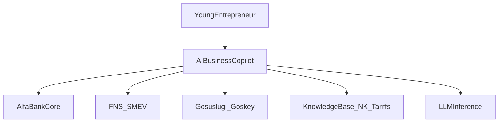

# System Context (C4 L1)

## Назначение

AI Business Copilot помогает молодому предпринимателю вести легальный микробизнес: налоги, документы, платежи — через диалог и Generative UI, с опорой на продукты Платежного бизнеса Альфа-Банка.

## Контекстная диаграмма

## Акторы

| Актор | Интерес |
|-------|---------|
| Предприниматель (НПД/ИП) | Понятные налоги, платежи, меньше страха |
| Сотрудник банка / поддержка | Handoff, аудит рекомендаций |
| Комплаенс / ИБ | Контроль рисков, маскирование, логи |
| ФНС / СМЭВ | Официальные данные долга/регистрации |
| Платформа Альфы | РКО, эквайринг, кредиты, 115-ФЗ |

## Внешние системы

| Система | Demo | Production |
|---------|------|------------|
| LLM | Cloud API (Go OpenAI-compatible client) | On-prem vLLM |
| Core banking | Mocks | Java adapters |
| ФНС | Mock ENP | СМЭВ |
| Госключ | — | Подписание |
| Vector KB | pgvector | Qdrant/Milvus |
| Events | — | Kafka |

## Границы системы

**Внутри Copilot:** orchestration agents, RAG, SDUI assembly, draft actions, UX.  
**Снаружи:** исполнение платежей, кредитный decisioning, официальная регистрация юрлица (через интеграции).

## Общие контракты demo↔prod

Любой клиент (Web или RN) говорит с backend через:

- Chat protocol (stream messages + tool parts)
- Tool names из [05-api-contracts.md](05-api-contracts.md)
- SDUI component types из [../design/04-generative-ui-catalog.md](../design/04-generative-ui-catalog.md)
- Intent enum: `TAX_CALC` | `LEGAL_REVIEW` | `ONBOARDING` | `GENERAL_QA` | `TRANSACTION`
