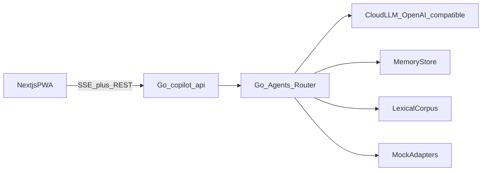

# Demo Architecture

## Обзор

Монорепо: **Next.js** (web) + **Go API** (единственный backend). Сессия и черновики — память процесса. Корпус знаний — лексический индекс, вшитый в бинарь.  
Банк и ФНС — in-process mocks с теми же tool-именами, что в production.  
Детальная спецификация Go: [09-demo-backend-go.md](09-demo-backend-go.md).  
Деплой на VPS: [../engineering/07-server-deployment.md](../engineering/07-server-deployment.md).

## Компоненты

| Компонент | Ответственность |
|-----------|-----------------|
| `apps/web` | Landing, Home dashboard, chat GenUI, demo script |
| `apps/api` | **Go**: HTTP, SSE chat, agents, tools, mocks, RAG |
| `packages/shared` | JSON-фикстура карточки налога, общий список намерений |
| `deploy/` | prod compose, Nginx/Caddy, remote scripts |
| `internal/rag` | лексический поиск по вшитому корпусу |
| MockAdapters | transactions, 115-ФЗ, FNS debt, payment draft |

## Chat flow

1. Client → `POST /api/v1/chat` (SSE).  
2. Guard (regex + policy).  
3. Router agent → JSON intent.  
4. Specialist ± tools; цифры налогов из `internal/calc` (детерминированно).  
5. Stream: `token` / `sdui` / `done` events.  
6. Client maps SDUI → React components.

## Data stores (demo)

Всё в памяти процесса: профиль, операции, черновики, история чата, загруженный договор. Корпус — JSONL внутри бинаря, без эмбеддингов.

## Config

См. полный список в [09-demo-backend-go.md](09-demo-backend-go.md):  
`LLM_*`, `DEMO_TOKEN`, `CORS_ORIGINS`, `DEMO_OFFLINE`, `UPLOAD_DIR`.

## Deploy demo

| Env | How |
|-----|-----|
| Local | `docker compose up` — api + web |
| Server | Nginx/Caddy + TLS + DNS — [07-server-deployment.md](../engineering/07-server-deployment.md) |

GPU не нужен. Один бинарь Go + Node web.

## Соответствие production

| Demo | Production |
|------|------------|
| Go monolith (API+agents) | Go BFF + Python AI swarm |
| mock adapters | Java/Go core adapters |
| Cloud LLM via OpenAI-compatible URL | on-prem vLLM (тот же client interface) |
| SSE | сохранить или эволюционировать |

Контракты tools/SDUI/intents — общие ([05-api-contracts.md](05-api-contracts.md)).
