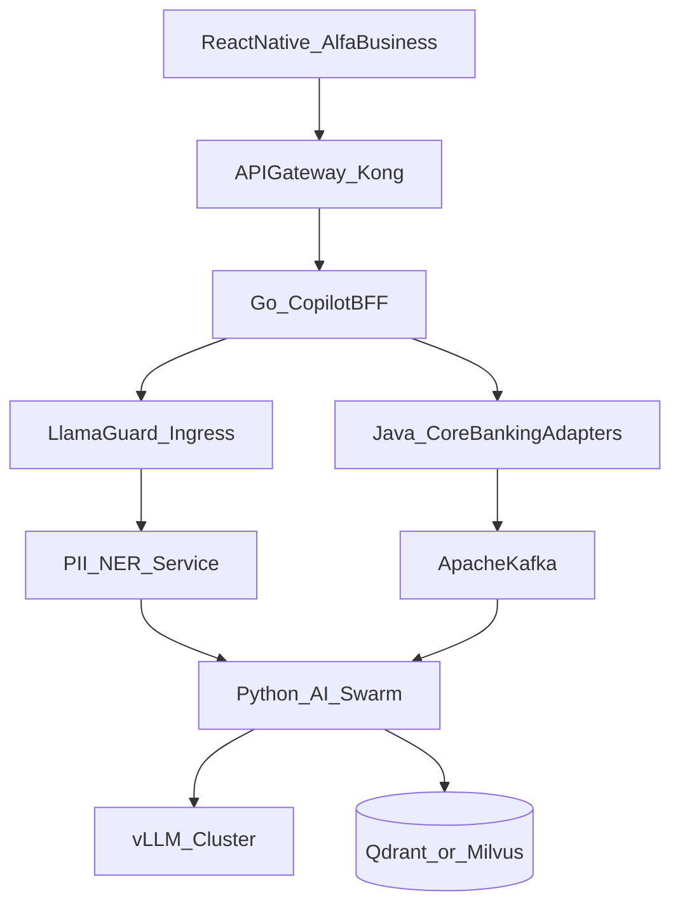

# Production Architecture

## Обзор

Микросервисный контур банка: мобильный SuperApp, API Gateway, Go-роутер диалогов, Python AI Swarm, Java core adapters, Kafka для проактивности, on-prem LLM.

## Сервисы

| Сервис | Стек | Роль |
|--------|------|------|
| Copilot BFF / Router | Go | Сессии, auth context, rate limit, fan-out |
| AI Swarm | Python FastAPI + LangGraph/LlamaIndex | Agents, RAG, tools orchestration |
| Core Banking Adapters | Java/Spring | Transactions, payments, accounts |
| Compliance Adapter | Java/Go | 115-ФЗ risk |
| FNS/SMEV Adapter | Java | ENP balance, declarations |
| Alert Worker | Go/Python | Kafka → push triggers |
| NER Masking | Python | Токенизация PII до LLM |
| Inference | vLLM / TensorRT-LLM | Llama 3 70B / Qwen 2.5 72B; Mixtral router |
| Vector DB | Qdrant или Milvus | НК РФ, тарифы, политики банка |
| API Gateway | Kong/Nginx | mTLS, WAF, routing |

## Модели

| Роль | Модель |
|------|--------|
| Reasoning (tax/legal/CFO) | Llama 3 70B или Qwen 2.5 72B |
| Fast routing | Mixtral 8x7B |
| Embeddings | BGE-m3 или E5-large (RU) |
| Safety | Llama Guard (или эквивалент банка) |

## Eventing (Kafka)

Топики (пример):

- `core.transactions.posted`
- `compliance.alerts.v1`
- `copilot.notifications.out`
- `copilot.audit.tool_calls`

Consumer Alert Worker считает признаки кассового разрыва / дедлайны ЕНП и пишет в outbox уведомлений.

## Mobile

- React Native (TypeScript) в SuperApp.  
- State: Zustand + React Query.  
- UI Kit: Alfa + Markdown + charts (Victory/Recharts-аналоги RN).  
- GenUI: реестр нативных компонентов 1:1 с web SDUI types.

## Network & security zones

- Inference и vector DB — закрытый контур.  
- BFF в application zone; core — через service mesh.  
- Секреты — vault банка.  
- Аудит — immutable log store.

## Mapping demo → prod

| Demo | Production |
|------|------------|
| Next.js | React Native (+ optional web) |
| Go monolith (API+agents) | Go BFF + Python AI |
| pgvector | Qdrant/Milvus |
| Cloud LLM | vLLM on-prem |
| Mocks | Java adapters |
| — | Kafka proactive |

Контракты tools/SDUI/intents **не меняются** — см. [05-api-contracts.md](05-api-contracts.md).
