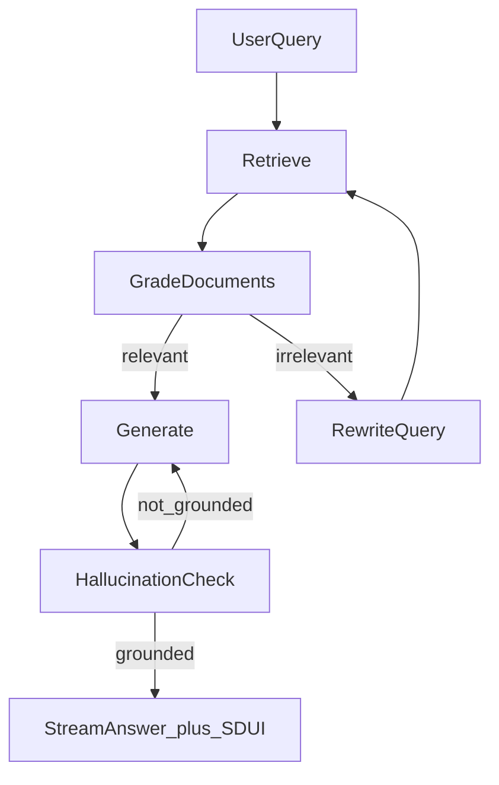

# Agentic RAG — Multi-Agent Architecture

## Принцип

Не один LLM «обо всём», а **рой** узких агентов + retrieval из актуальной базы. ИИ не обучается на клиентских данных: данные только в prompt context / tools.

## Агенты

| Агент | Intent | Инструменты | Источник знаний |
|-------|--------|-------------|-----------------|
| Router | — | classify only | — |
| Accountant (Tax) | `TAX_CALC` | transactions, fns_debt, calculate_tax, payment_draft | НК РФ, политики НПД/УСН |
| Legal | `LEGAL_REVIEW` | scan_legal_document | шаблоны рисков, (prod) Гарант/Консультант) |
| CFO | `GENERAL_QA` / finance | transactions, unit_economics | внутренние метрики |
| Onboarding | `ONBOARDING` | update_onboarding_profile | ОКВЭД/справочники |
| Transaction | `TRANSACTION` | payment_draft, counterparty_risk | платежные правила |
| General QA | `GENERAL_QA` | retrieve_kb | тарифы банка, FAQ |

## Router output (strict JSON)

```json
{
  "intent": "TAX_CALC",
  "confidence": 0.95,
  "extracted_entities": {
    "period": "2026-Q3",
    "tax_regime": "USN_6"
  }
}
```

При `confidence < 0.6` — уточняющий вопрос, не маршрутизация вслепую.

## RAG pipeline (Corrective)



Для налогов: **обязательная** попытка цитирования статьи/фрагмента корпуса. Если корпуса нет — режим «расчётная модель» + усиленный дисклеймер (demo) или отказ (prod policy).

## Example dialogue

1. User: «Сколько налогов мне платить в этом месяце?»  
2. Router → `TAX_CALC`  
3. Accountant: SQL/API выручка → режим УСН 6% → сумма → draft платежки  
4. Copilot: текст + `TaxCard` + CTA «Сформировать платёжку»  
5. User confirm → `PaymentDraftCard`  

## Prompt ownership

Системные промпты версионируются в `docs/engineering/04-prompt-library.md` и в коде `packages/prompts` / `apps/api/prompts`. Любое изменение — review + eval regression.
