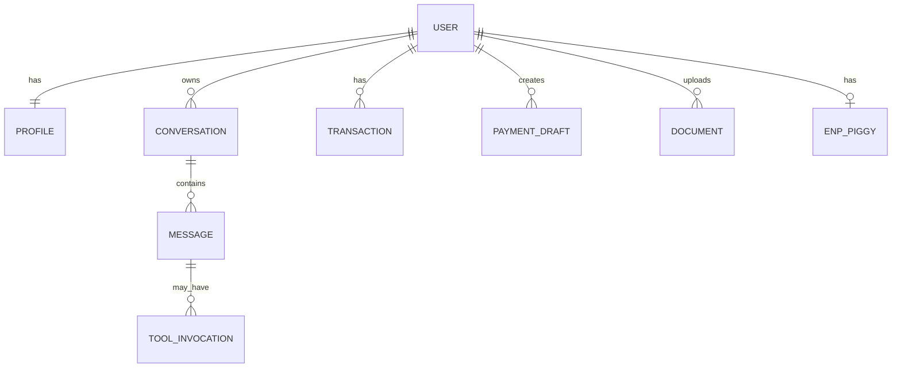

# Data Model

## ER (логический)

## Entities

### User

| Field | Type | Notes |
|-------|------|-------|
| id | uuid | PK |
| phone_hash | string | prod |
| created_at | timestamptz | |

### Profile

| Field | Type | Notes |
|-------|------|-------|
| user_id | uuid | PK/FK |
| display_name | string | demo seed |
| business_sphere | string | beauty_nails, … |
| city | string | |
| monthly_revenue_estimate | numeric | |
| tax_regime | enum | NPD, USN_6, … |
| okved_codes | text[] | |
| cjm_level | int | 1–10 |
| persona_key | string | demo: `masha_nails` |

### Conversation / Message

| Field | Type |
|-------|------|
| id | uuid |
| role | user \| assistant \| system \| tool |
| content | jsonb | text parts + tool parts |
| created_at | timestamptz |

### Transaction

| Field | Type |
|-------|------|
| id | uuid |
| amount | numeric |
| direction | in \| out |
| counterparty_name | string |
| counterparty_inn | string \| null |
| booked_at | timestamptz |
| category | string |

### PaymentDraft

| Field | Type |
|-------|------|
| id | uuid |
| amount | numeric |
| purpose | string |
| status | draft \| confirmed_mock \| pending_sign \| signed \| rejected |
| risk_level | green \| yellow \| red \| null |

### Document

| Field | Type |
|-------|------|
| id | uuid |
| kind | legal_pdf \| receipt \| other |
| storage_uri | string |
| scan_result | jsonb \| null |

### EnpPiggy

| Field | Type |
|-------|------|
| user_id | uuid |
| rate_percent | numeric |
| balance | numeric |
| enabled | bool |

### EmbeddingChunk (KB)

| Field | Type |
|-------|------|
| id | uuid |
| source | string | e.g. NK_RF:art346 |
| text | text |
| embedding | vector |
| version | string | corpus version |

## Demo seed

Persona `masha_nails`:

- Сфера: маникюр  
- Город: Казань  
- Оборот: 180_000  
- Режим: NPD (рассматривает ИП УСН 6%)  
- Транзакции: 30 дней mixed income/expense  
- Piggy: 6% enabled  

## Retention / privacy

- Prod: chat retention per bank policy; PII minimized in message logs (masked).  
- Demo: wipeable SQLite/Postgres volume; no real PII.
