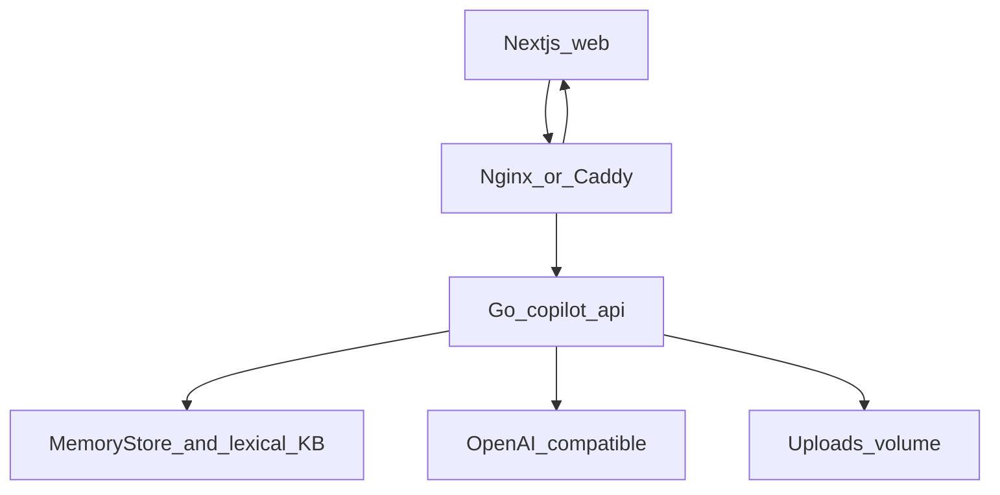
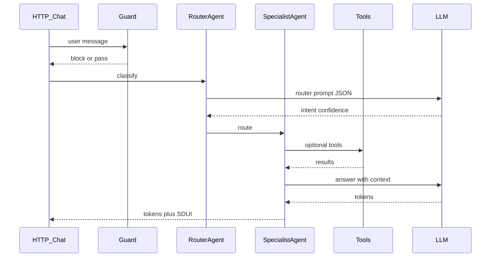

# Demo Backend — Go (детальная спецификация)

**Решение:** весь demo API и AI-оркестрация — **один сервис на Go**.  
Python/FastAPI в демо **не используется**. Это упрощает деплой на один VPS и ближе к production BFF на Go ([03-production-architecture.md](03-production-architecture.md)).

## Цели

1. Стабильный HTTP API для Next.js (chat stream, REST, uploads).  
2. Multi-agent flow (Router → Tax / Legal / CFO / Onboarding / General) на Go.  
3. Те же tool names / SDUI / intents, что в production contracts.  
4. Готовность к выкладке на ваш сервер (Docker + Nginx + TLS + домен).  
5. Offline/pitch режим без LLM key.

## Высокоуровневая схема



На локали Nginx опционален (Next proxy → Go). На сервере — обязателен TLS termination.

## Чистая архитектура (пакеты)

```text
apps/api/                          # Go module: github.com/.../copilot-api
├── cmd/
│   ├── api/main.go                # entrypoint HTTP
│   └── seed/main.go               # persona Маша
├── internal/
│   ├── config/                    # env via caarlos0/env или similar
│   ├── domain/                    # User, Profile, Draft, TaxResult…
│   ├── ports/                     # interfaces: Banking, FNS, LLM, Embedder, Store
│   ├── adapters/
│   │   ├── memory/                # session, drafts, seed persona
│   │   └── mockbank/              # transactions, 115-fz, payment draft
│   ├── tools/                     # tool registry + handlers (same names as docs)
│   ├── agents/
│   │   ├── router.go
│   │   ├── accountant.go
│   │   ├── legal.go
│   │   ├── cfo.go
│   │   ├── onboarding.go
│   │   └── guard.go
│   ├── rag/                       # lexical retrieve, embedded JSONL
│   ├── calc/                      # pure tax + unit economics (no I/O) — TDD
│   ├── httpserver/
│   │   ├── router.go              # chi
│   │   ├── middleware.go          # request ID, CORS, auth mock, recover, limit
│   │   ├── chat.go                # SSE stream
│   │   ├── rest.go                # me, transactions, drafts, documents
│   │   └── health.go
│   └── sdui/                      # build SDUI envelopes
├── Dockerfile
└── go.mod
```

### Правила слоёв

- `calc` и `domain` — без импорта `net/http`, LLM, SQL.  
- `agents` зависят от `ports`, не от конкретного OpenAI SDK.  
- `mockbank` / `mockfns` реализуют те же интерфейсы, что позже заменят HTTP-клиенты core.

## HTTP API (реализует Go)

Контракты — [05-api-contracts.md](05-api-contracts.md). Минимальный набор handlers:

| Method | Path | Handler |
|--------|------|---------|
| GET | `/api/v1/health` | liveness |
| GET | `/api/v1/ready` | memory store + corpus size |
| POST | `/api/v1/chat` | SSE chat |
| GET | `/api/v1/me` | profile |
| PATCH | `/api/v1/me/onboarding` | onboarding |
| GET | `/api/v1/transactions` | list |
| POST | `/api/v1/payments/draft` | create draft |
| POST | `/api/v1/payments/draft/{id}/confirm` | confirm mock |
| POST | `/api/v1/documents/legal` | multipart upload |
| GET | `/api/v1/demo/script` | list pitch prompts (optional) |

### Auth (demo)

- Header `Authorization: Bearer <token>`.  
- Demo accept: static `DEMO_TOKEN` или JWT HS256 с `user_id=masha`.  
- Middleware кладёт `UserID` в context.

### CORS

- `CORS_ORIGINS=https://app.example.ru,http://localhost:3000`  
- Credentials если нужны cookies — по умолчанию Bearer only.

## Chat streaming (SSE)

Формат ответа — **Server-Sent Events**, удобный для кастомного клиента и проксирования Nginx:

```text
event: meta
data: {"conversation_id":"...","intent":"TAX_CALC"}

event: token
data: {"text":"По "}

event: token
data: {"text":"НПД…"}

event: sdui
data: {"schema_version":1,"component":"TaxCard","props":{...}}

event: done
data: {"finish_reason":"stop"}

event: error
data: {"code":"GUARDRAIL_BLOCKED","message":"..."}
```

Next.js: тонкий client (`EventSource` / `fetch` stream reader) + тот же `GenUIRenderer`.  
Vercel AI SDK можно использовать на web для UX-хелперов, но **источник истины стрима — Go SSE** (проще дебажить за Nginx на VPS).

Альтернатива (фаза 2): Data Stream Protocol AI SDK — только если появится явная нужда; не блокер MVP.

## Agent pipeline (Go)



### Router

- System prompt из `prompts/router.txt` ([../engineering/04-prompt-library.md](../engineering/04-prompt-library.md)).  
- Strict JSON unmarshal в `IntentResult`.  
- `confidence < 0.6` → clarifying question, без specialist.

### Tools (имена = production)

Регистрация в `tools.Registry`:

- `get_client_transactions`  
- `check_counterparty_risk`  
- `create_payment_draft`  
- `fetch_fns_debt`  
- `calculate_tax`  
- `compute_unit_economics`  
- `scan_legal_document`  
- `update_onboarding_profile`  
- `retrieve_kb`  

LLM function-calling: JSON schema tools → OpenAI-compatible `tools` API.  
Если провайдер без tools — fallback: агент просит Go выполнить tool по regex/intent (accountant path всегда зовёт `calculate_tax` детерминированно).

### Pure calc (обязательный TDD)

`internal/calc/tax.go`, `unit_economics.go` — эталон сумм для golden tests **без LLM**.  
LLM объясняет и упаковывает SDUI; цифры из `calc`.

## LLM provider abstraction

```go
type ChatClient interface {
    Chat(ctx context.Context, req ChatRequest) (ChatResponse, error)
    ChatStream(ctx context.Context, req ChatRequest, out chan<- StreamEvent) error
}
```

Реализации:

- `openai` — OpenAI / OpenRouter / любой compatible base URL  
- `anthropic` (optional)  
- `offline` — фикстуры из `testdata/offline/*.jsonl` при `DEMO_OFFLINE=1`

Env:

```env
LLM_BASE_URL=https://api.openai.com/v1
LLM_API_KEY=
LLM_MODEL=gpt-4o-mini
LLM_ROUTER_MODEL=gpt-4o-mini
DEMO_OFFLINE=0
```

Смена на on-prem позже = другой `LLM_BASE_URL` (vLLM OpenAI-compatible) без смены агентов.

## RAG (demo)

- Корпус — `internal/rag/data/*.jsonl`, вшит в бинарь (`go:embed`).
- Поиск — лексический рейтинг в памяти процесса, без эмбеддингов.
- Суммы налога всегда из `internal/calc`. Фрагмент корпуса только цитата рядом.

## Persistence

| Store | Use |
|-------|-----|
| Память процесса | users, chat, txns, drafts |
| Бинарь | корпус знаний |
| Volume `/data/uploads` | PDF legal |

Отдельной базы и Redis в демо нет. Сид Маши создаётся при старте API.

## Observability

- `log/slog` JSON: `request_id`, `user_id`, `intent`, `latency_ms`, `model`.  
- Не логировать raw API keys / полные PII.  
- Metrics (optional): `/metrics` Prometheus — `chat_requests_total`, `llm_errors_total`.  
- Health/Ready для Docker и Nginx upstream checks.

## Security (demo, но «по-взрослому»)

- Max upload 10MB; MIME allow `application/pdf`.  
- Path traversal safe filenames (uuid).  
- Guardrail keywords + LLM refusal prompt.  
- Confirm payment = status flip only.  
- Secrets только в env / Docker secrets на сервере.  
- `GODEBUG` / pprof закрыты снаружи (только localhost).

## Конфиг (полный список)

| Variable | Example | Required |
|----------|---------|----------|
| `HTTP_ADDR` | `:8080` | yes |
| `DEMO_TOKEN` | long random | yes |
| `CORS_ORIGINS` | `https://copilot.example.ru` | yes (prod) |
| `LLM_*` | see above | unless offline |
| `UPLOAD_DIR` | `/data/uploads` | yes |
| `DEMO_OFFLINE` | `0/1` | no |
| `LOG_LEVEL` | `info` | no |

## Тестирование бэкенда

| Layer | Tool |
|-------|------|
| Unit calc | `go test ./internal/calc/...` |
| Tools/mocks | `go test ./internal/tools/...` |
| HTTP | `go test` пакетов API |
| Agent offline | `DEMO_OFFLINE=1` golden SSE snapshots |
| Race | `go test -race ./...` |

## Соответствие production Go BFF

| Demo Go | Production Go |
|---------|----------------|
| Monolith API+agents | BFF + отдельный Python AI |
| mockbank adapters | gRPC/HTTP core adapters |
| Cloud LLM | on-prem via same `ChatClient` |
| SSE | может остаться или gRPC-web |

Имена tools/SDUI **не менять** при распиле на микросервисы.

## Definition of Done (backend)

- [ ] Все REST + SSE из таблицы работают  
- [ ] Seed Маша + tax golden без LLM  
- [ ] Docker image multi-stage (~ scratch/distroless)  
- [ ] `/ready` красный если нет DB  
- [ ] README: `make api` / `make test-api`  
- [ ] Готов к подключению за Nginx по [../engineering/07-server-deployment.md](../engineering/07-server-deployment.md)  
