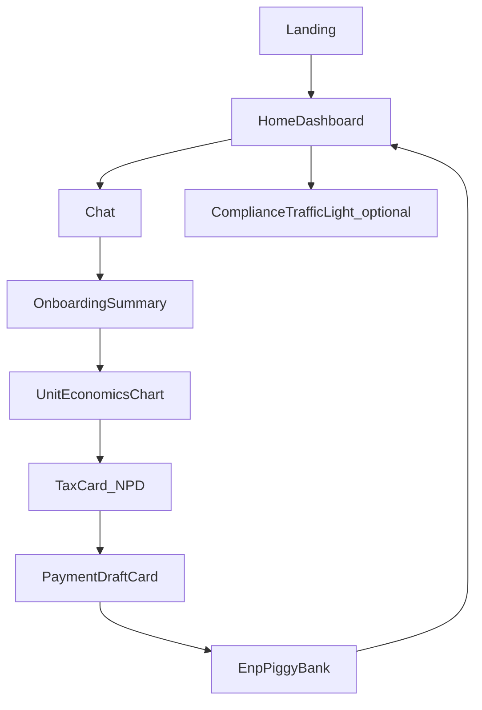
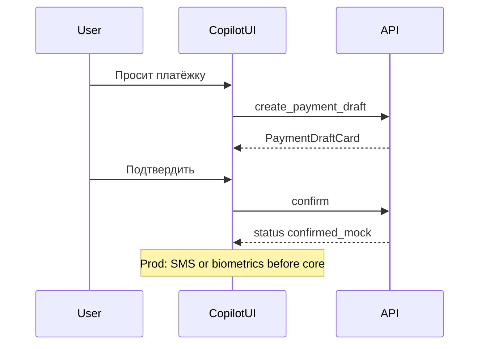

# Screen Map & Flows

## Demo screens

| Screen | Route | Purpose |
|--------|-------|---------|
| Landing / Pitch | `/` | Бренд + CTA; паттерны bento/carousel/phone-mock ([08](08-alfa-marketing-ui-patterns.md), реф. 02–04) |
| **Home / Dashboard** | `/app` | Decision-first: hero-налог, копилка, инсайты, composer ([07-dashboard-patterns.md](07-dashboard-patterns.md)) |
| Chat | `/app/chat` | Полный диалог + GenUI |
| Trackboard | `/app/journey` | CJM 1–5 (optional tab) |
| Legal upload | modal in chat | PDF |
| Demo script | `/demo` | Кнопки готовых промптов для жюри |

> Home ≠ склад виджетов: один главный metric + один CTA. Чат — drill-down и ask-first.

## Production screens (RN)

| Screen | Entry |
|--------|-------|
| Copilot Tab / FAB overlay | SuperApp |
| Full chat | Tab |
| Widget detail (payment review) | from card |
| Settings: piggy rate, disclaimers | profile |
| Handoff to human | chat |

## Primary demo flow — «Маша»

После ключевых GenUI-действий пользователь возвращается на Home с обновлённой hero-метрикой.

Scripted prompts (для `/demo`):

1. «Привет! Я делаю маникюр на дому в Казани, где-то 180 тысяч в месяц, пока без ИП.»  
2. «Посчитай, сколько клиентов в день нужно, если аренда кабинета 40к, расходники 200₽, цена услуги 1500.»  
3. «Сколько мне отложить на налог за этот месяц?»  
4. «Сформируй платёжку.»  
5. «Включи копилку 6%.»  
6. «Проверь ИНН 7707083893» (мок).

## Payment confirm flow

## Empty / error / loading

- Listening / Thinking / Acting — Lottie или CSS (см. motion).  
- Offline LLM — баннер + scripted mode.  
- Guardrail block — спокойный отказ, не «ERROR 403».
